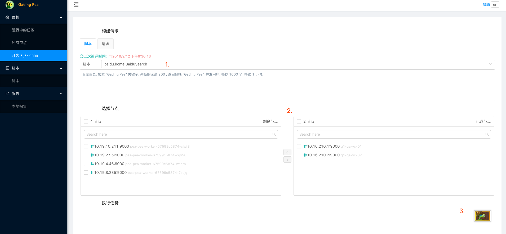
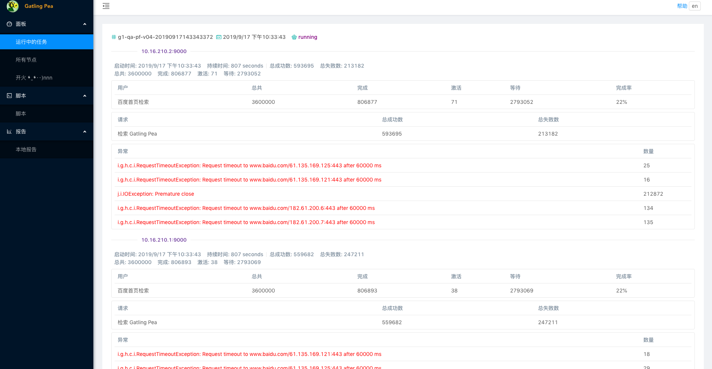
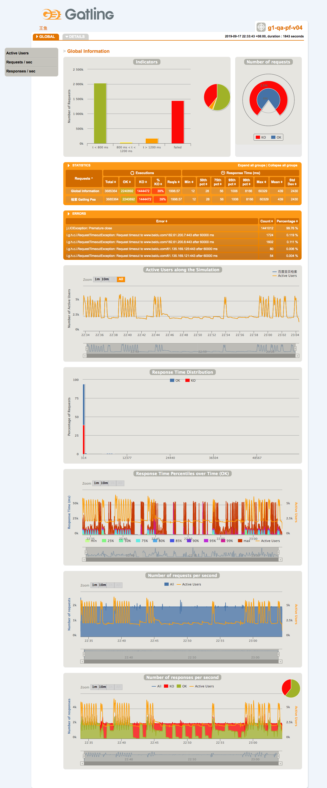
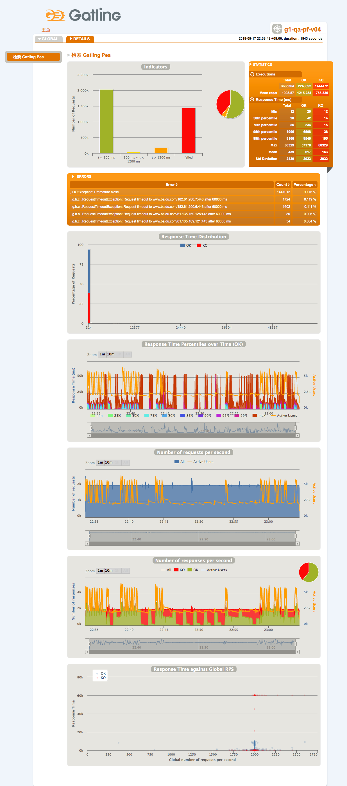

# Enhanced Pea
在原作者的Gatling Pea基础上进行了改进，增加了一些新的功能。
附上原作者的博客地址https://ojlm.tech/docs/pea/
里面有相关的资料以及原github地址

## Gatling Pea


[](https://travis-ci.org/asura-pro/pea)


---

### 关于 Gatling

[Gatling](http://gatling.io/) 是基于 [Netty](https://netty.io/) 和 [Akka](http://akka.io/) 技术实现的高性能压测工具.

### 关于 Pea

由于单独一台机器硬件资源和网络协议的限制存在, 在高负载测试中需要多台机器共同提供负载. `Pea` 是在以 `Galting` 为引擎, 在多节点场景下的压测工具. 包含以下特性:

- 管理和监控多个工作节点. 依赖 Zookeeper
- 运行过程中可以实时查看每个节点的具体执行状态
- 多个节点执行完后会自动收集日志, 生成统一的报告
- 支持原生的 Gatling 脚本, 原生的 `HTTP` 协议
- 扩展支持了 `Dubbo`和 `Grpc` 协议
- 以 Git 仓库管理脚本和资源文件
- 内置了 Scala 增量编译器, 脚本可在线快速编译
- 不同于其他实现, 所有这些功能都在同一进程内实现. 感谢 Gatling 作者高质量的代码
- 可以在实体机, 虚拟机, Docker 容器中运行

---

### 新功能
- 在线编辑脚本相关文件以及同步到个节点，方便在线直接修改参数，针对无法使用git的场景
- 完善增量编译的功能，可以直接进行jar包替换，增量编译
- 增加了一些可配置的参数，方便维护
- 嵌入了arthas的web页面操作，可以直接在页面上进行性能排查
- 优化了一些类加载，卸载的问题

### 脚本示例

```scala
import io.gatling.core.Predef._
import pea.dubbo.Predef._
import pea.dubbo.api.GreetingService
import pea.gatling.PeaSimulation

class DubboGreetingSimulation extends PeaSimulation {
  override val description: String =
    """
      |Dubbo simulation example
      |""".stripMargin
  val dubboProtocol = dubbo
    .application("gatling-pea")
    .endpoint("127.0.0.1", 20880)
    .threads(10)
  val scn = scenario("dubbo")
    .exec(
      invoke(classOf[GreetingService]) { (service, _) =>
        service.sayHello("pea")
      }.check(simple { response =>
        response.value == "hi, pea"
      }).check(
        jsonPath("$").is("hi, pea")
      )
    )
  setUp(
    scn.inject(atOnceUsers(10000))
  ).protocols(dubboProtocol)
}
```

---

### 版本

| pea    | gatling| dubbo   |  grpc  |
| ------ | ------ | ------- | ------ |
| 0.6.0~ | 3.3.1  | 2.7.4.1 | 1.22.2 |

---

### 视频演示

> https://www.bilibili.com/video/av73339161/

### 截图示例

`创建任务`


`任务执行中的节点状态`


`整体报告`


`单个请求细节报告`

